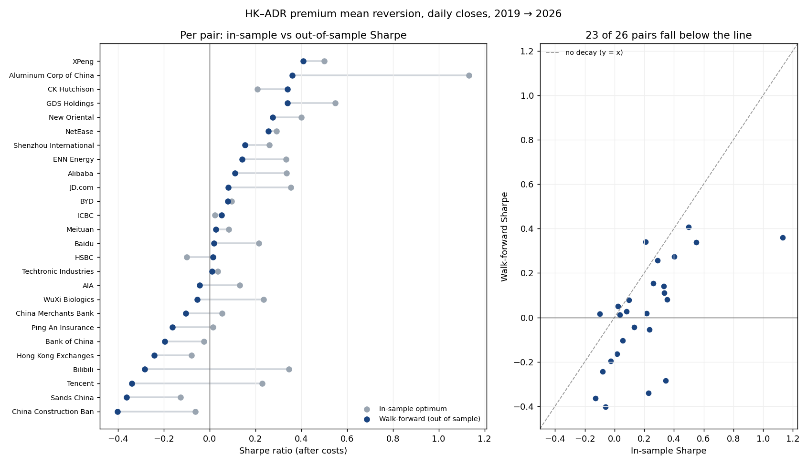
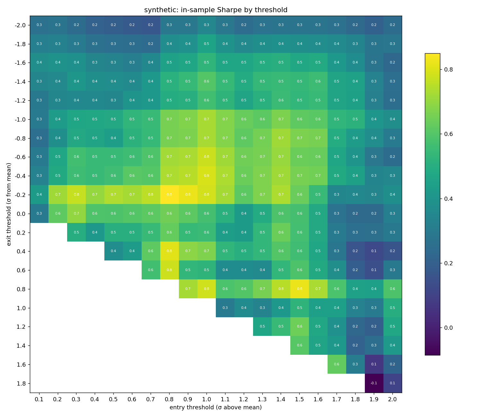
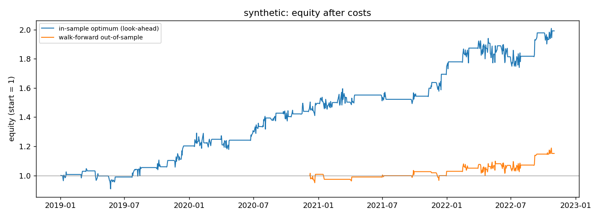

# HK–ADR Premium Arbitrage: a Look-Ahead-Free Backtest

Do US ADRs of Hong Kong–listed companies trade at a premium or discount to their Hong Kong shares that reliably mean-reverts, and does anything survive **realistic session timing, trading costs, financing, and out-of-sample testing**?

This repo is a research toolkit for that question. It covers 34 HK/ADR pairs (Tencent, Alibaba, Meituan, HSBC, BeiGene, JD, and others), a threshold mean-reversion rule, a full HK/US cost model, and a walk-forward evaluation. The walk-forward shows how much of a grid-searched backtest is real and how much is overfitting.

> Research code, not investment advice. All cost numbers are public fee schedules or clearly labelled illustrative assumptions.

---

## The idea

Many large HK companies are also listed in the US as ADRs. One ADR represents a fixed number of HK shares, for example 1 BABA ADR = 8 shares of 9988.HK. Once you convert the ADR price into HK-share terms at the USD/HKD rate, the two prices should be almost identical:

```
premium_t = (ADR_price × ADRs_per_share × USDHKD) / HK_price − 1
```

When the premium is unusually high, **sell the ADR and buy the HK shares**. When it falls back, unwind both legs and keep the difference.

## Why this is harder than it looks: the markets never overlap

```
HKT   09:30 ─── HK session ─── 16:00          21:30 ─── US session ─── 04:00 (+1)
                               │                │
                     signal computed here       ADR leg fills here
                (HK close vs. last US close)    (next US session)
```

A naive backtest puts the HK close and the US close for the *same calendar date* side by side and assumes both legs trade at those prices. That uses information that doesn't exist at decision time: the US close on date *d* happens hours after the HK close on *d*. This repo builds every row on the **Hong Kong trading date** and uses only data that is actually available (`src/adr_hk_arb/data.py`):

| column | meaning | known when |
|---|---|---|
| `hk` | HK close on date *d* | 16:00 HKT, *d* |
| `adr_sig`, `fx_sig` | last US close / FX strictly **before** *d* | 16:00 HKT, *d* |
| `adr_exec`, `fx_exec` | first US close **on or after** *d* | when the ADR leg fills |

The signal uses only `hk`, `adr_sig`, and `fx_sig`. The P&L uses `adr_exec`, so the **overnight legging risk** (the ADR moving between the HK buy and the US sell) is part of the results instead of being assumed away. A test in `tests/test_core.py` asserts this property.

## Strategy

- **Enter** (long HK, short an equal notional of ADR) when `premium > mean + entry_k·σ`
- **Exit** when `premium ≤ mean + exit_k·σ` (a hysteresis band, `entry_k > exit_k`)
- Optional time stop (`max_hold_days`), and an optional mirror trade that is off by default because it requires shorting the HK line
- Static hedge within each trade, P&L measured on one leg's notional, equity compounding across trades

## Costs (`src/adr_hk_arb/costs.py`)

| component | default | source / note |
|---|---|---|
| HK stamp duty | 0.10% per side | IRD; 0.13% before the Nov 2023 cut — check the current rate |
| SFC levy / AFRC levy / HKEX trading fee | 0.0027% / 0.00015% / 0.00565% | HKEX fee schedule |
| Commissions | 1 bp per leg | assumption |
| Slippage | 2 bp per leg per side | assumption |
| Funding the HK long | 50 bp/yr | illustrative, set to your broker |
| Borrowing the short ADR | 30 bp/yr | illustrative; hard-to-borrow names can cost far more |

With these defaults a round trip costs about **34 bp**. That is a large hurdle for a premium whose standard deviation is typically around 1–3%.

## Evaluation: in-sample grid vs. walk-forward

1. **In-sample optimum (baseline).** Compute the premium's mean and σ on the full history, backtest a 20 × 21 grid of `(entry_k, exit_k)`, and report the best cell. This is what a single-pass grid search produces, and it is optimistic twice over: the bands use future data, and the reported cell is the luckiest of about 400.
2. **Walk-forward (the honest number).** Fit the mean, σ, and best thresholds on a trailing 2-year window, trade the next 6 months with those parameters frozen, then roll forward. Only the stitched test windows are reported.

The gap between the two is the headline result for each pair.

## Results: 26 pairs, daily closes, Jan 2019 → 2026

<p align="center">
  
</p>

| | In-sample optimum | Walk-forward (out of sample) |
|---|---|---|
| Median Sharpe (after costs) | 0.21 | **0.02** |
| Pairs with Sharpe > 0 | 21 / 26 | 16 / 26 |
| Pairs with Sharpe > 0.3 | 8 / 26 | 4 / 26 |
| Median annual return | — | −1.4% |
| Median max drawdown | — | −23% |

**What this says**

- **Once session timing and costs are modelled, there is no robust edge in daily closes.** The median pair earns roughly nothing out of sample, and the best walk-forward Sharpe is 0.41 (XPeng, on only 13 trades).
- **The grid search overfits.** 23 of 26 pairs do worse out of sample than their in-sample optimum; the median pair loses 0.17 of Sharpe. Aluminum Corp of China drops from 1.13 to 0.36, and Tencent and Bilibili flip from positive to clearly negative.
- **In-sample rank still carries some information** (rank correlation 0.69 between in-sample and out-of-sample Sharpe), so the pairs that look better are somewhat more likely to hold up, just far less well than the in-sample numbers suggest.
- An earlier version of this research, which compared same-day HK and US closes and optimised on the full sample, showed far higher Sharpe ratios. Most of that gap is the look-ahead and overfitting this repository is designed to remove.

Full per-pair numbers are in [`results/universe_summary.csv`](results/universe_summary.csv).

**Caveats on these numbers**

- **Survivorship:** 8 of the 34 pairs could not be tested because their ADRs are delisted or renamed on Yahoo Finance (LFC, SNP, PTR, SHI, CEA, ZNH, HNP and BGNE), so the tested universe leans toward names that are still listed.
- **ADR ratios:** `pairs.csv` ratios are as of early 2022. `run_universe.py` now reports each pair's median premium and flags `CHECK RATIO` when it is above 10%, which usually means a ratio change during the sample.

The synthetic-data figures below illustrate the method on a pair with a known, mean-reverting premium.

<p align="center">
  
  
</p>
<p align="center"><em>Synthetic data, not market data.</em></p>

## Quick start

```bash
pip install -r requirements.txt

# offline demo on synthetic data
python scripts/run_pair.py --synthetic

# one real pair (Yahoo Finance data)
python scripts/run_pair.py --hk 9988.HK --adr BABA --ratio 0.125 --start 2019-01-01

# the whole universe in config/pairs.csv, then the summary chart
python scripts/run_universe.py --start 2019-01-01
python scripts/plot_universe.py

# tests
pytest -q
```

Each run writes to `results/<pair>/`: Sharpe and return heatmaps, the premium chart with bands, an equity curve (in-sample vs. walk-forward), trade logs, per-fold parameters, and `summary.json`.

You can also use vendor data (Bloomberg, Refinitiv) through `--csv path.csv` with columns `date,series,close`, where `series` is one of `hk`, `adr`, `fx`.

## Repository layout

```
src/adr_hk_arb/
  data.py       download + HK/US session alignment (no look-ahead)
  costs.py      fee, slippage and financing model
  strategy.py   premium, threshold state machine, static-hedge backtest
  metrics.py    Sharpe, drawdown, win rates, trade statistics
  optimize.py   grid search, in-sample baseline, walk-forward
  plots.py      heatmaps, premium bands, equity curves
scripts/        run_pair.py, run_universe.py, plot_universe.py
results/        universe_summary.csv (latest universe run)
config/         pairs.csv (HK ticker, ADR ticker, ADRs per HK share)
tests/          correctness tests (alignment, look-ahead, costs, hedge P&L)
```

## Known limitations

- **Daily closes only.** Real execution would use the HK closing auction and a US order around the open or close. Intraday data would let you measure the premium at genuinely synchronous times, for example through HK-listed futures or the US pre-market.
- **Dividends and corporate actions.** Closes are split-adjusted but not dividend-adjusted, so ex-dividend dates on either leg show up as small premium jumps. ADR ratios and tickers change over time; verify `pairs.csv` (ratios listed are as of early 2022) before a run.
- **Conversion is not modelled.** The trade relies on convergence, not on creating or cancelling ADRs through the depositary, which is where the real arbitrage bound comes from, with its own fees and settlement delays.
- **Borrow availability.** A constant borrow rate is assumed. In practice some ADRs become hard to borrow exactly when their premium is largest.
- **Survivorship and capacity.** No market-impact model; positions are assumed small relative to volume.

## Background

This repository is a clean re-implementation of an earlier research notebook on the same idea. It is rebuilt from scratch using only public data and published fee schedules. Compared with that first version, the main changes are session-aware alignment, walk-forward parameter selection in place of full-sample optimization, explicit overnight legging risk, a configurable cost model, and unit tests.

## License

MIT. See [LICENSE](LICENSE).

Author: Iris (Hewenjia) Tang · [LinkedIn](https://www.linkedin.com/in/hewenjia-iris-tang-686718194)
